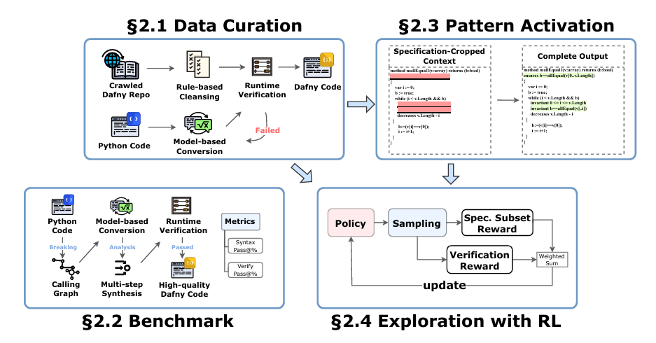
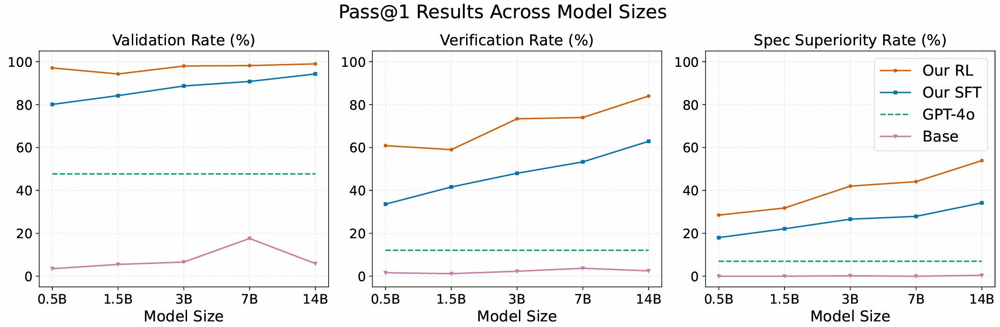
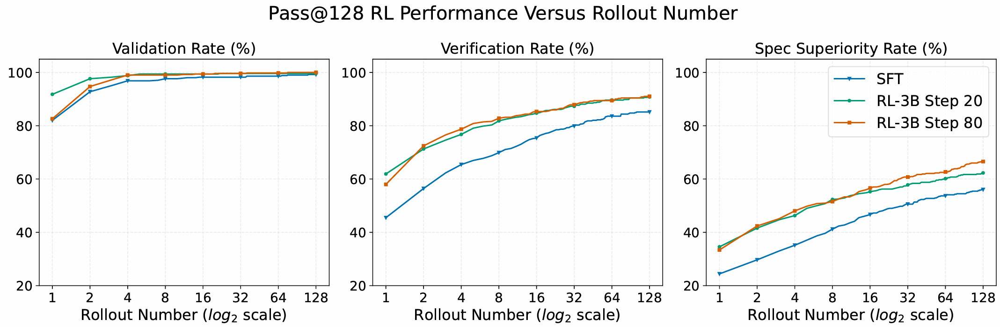

# Veri-Code
[🌐 Project Page](https://veri-code.github.io/ReForm-page) | [📄 arXiv Paper](https://arxiv.org/abs/2507.16331)


A framework for code to specification generation using large language models, based on Supervised Fine-Tuning (SFT) and Reinforcement Learning (RL).




## Table of Contents
- [Installation](#installation)
- [Dataset and Model](#dataset-and-model)
- [Training](#training)
- [Evaluation](#evaluation)
- [SFT Training](#sft-training)
- [Reference](#reference)

## Installation
We recommend using conda for environment setup:

```bash
conda create -n vericode python=3.10
conda activate vericode

pip install torch==2.6.0

# Install FlashAttention (make sure your CUDA and PyTorch versions match)
wget https://github.com/Dao-AILab/flash-attention/releases/download/v2.7.4.post1/flash_attn-2.7.4.post1+cu12torch2.6cxx11abiFALSE-cp310-cp310-linux_x86_64.whl
pip install flash_attn-2.7.4.post1+cu12torch2.6cxx11abiFALSE-cp310-cp310-linux_x86_64.whl

pip install -r requirements.txt
```

## Dataset and Model
- The Python2Dafny dataset is located in the dataset/ directory.

- SFT and RL model checkpoints can be downloaded from https://huggingface.co/Veri-Code.

Available checkpoints:

- SFT : sft_0.5B, sft_1.5B, sft_3B, sft_7B, sft_14B

- RL fine-tuned model: 14B-RL-entropy

Available datasets:

- Python2Dafny: 18k

- DafnyComp: 300

These dataset are in json format.
If you want to use the whole 18k data or your own json data for training, you can use 
```bash
python -m src.data_preprocess
```
to transform these json format data to parquet files for training.


## Training

To train using reinforcement learning (RL), you must first obtain a supervised fine-tuned (SFT) model. Download a checkpoint (e.g., sft_0.5B) and set MODEL_PATH in train.sh accordingly.

The dataset used for training and evaluation is Python2Dafny by default.

### Hyperparameters 
- reward_model.score_version: [0.4,0.4] for Subset reward, [0.8, 0.0] for naive reward
- actor_rollout_ref.actor.use_kl_loss=True and actor_rollout_ref.actor.kl_loss_coef=0.01 for KL loss, False and 0.0 for no KL loss
- actor_rollout_ref.actor.entropy_coeff=0.01 for entropy loss, 0.0 for no entropy loss


### Single-node training

```bash
bash train.sh
```

### Multi-node training
We use ray for multi-node training.

```bash
bash train_multi_node.sh
```


## Evaluation




To evaluate the model, please input the log directory of the model you want to evaluate. The default folder name for the log directory is `logs` if you use the default training script.
```bash
python -m src.evaluation --workers 96 --folder_name logs/YOUR_LOG_DIR
```

Evaluation logs (in JSON format) will be saved to the `eval_logs` folder by default.

To visualize results:

```bash
python src.plot --file_list eval_logs/YOUR_SCORE_JSON_FILES --training_length TRAINING_LENGTH
```

Here, `TRAINING_LENGTH` can be the number of validation times (number of dafny files in your log) minus 1.


## SFT Training
If you want to train the SFT model by yourself, please refer to `LLaMA-Factory/README.md` for details.

## Reference
This repository build on top of [LLaMA-Factory](https://github.com/hiyouga/LLaMA-Factory) and [Verl](https://github.com/volcengine/verl). 

The `verl/` directory is primarily copied from the Verl repository. We made modifications in the directory `verl/trainer/` and `verl/utils/reward_score/`.

## Citation

If you use this work in your research, please cite:

```bibtex
@misc{yan2025reformreducinghuman,
      title={Re:Form -- Reducing Human Priors in Scalable Formal Software Verification with RL in LLMs: A Preliminary Study on Dafny}, 
      author={Chuanhao Yan and Fengdi Che and Xuhan Huang and Xu Xu and Xin Li and Yizhi Li and Xingwei Qu and Jingzhe Shi and Zhuangzhuang He and Chenghua Lin and Yaodong Yang and Binhang Yuan and Hang Zhao and Yu Qiao and Bowen Zhou and Jie Fu},
      year={2025},
      eprint={2507.16331},
      archivePrefix={arXiv},
      primaryClass={cs.CL},
      url={https://arxiv.org/abs/2507.16331}, 
}
```
